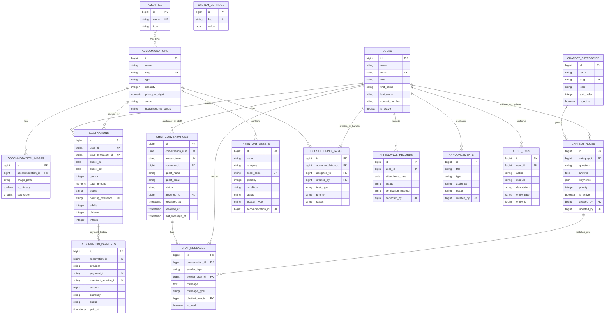

# DMD Resort Capstone ERD

This simplified ERD focuses on the main resort business entities that are actually present in the current PostgreSQL schema.

Excluded from this academic view:
- framework tables
- audit/history details
- low-level technical tables

## Notes

- The current database includes the chatbot entities and they are part of the live schema.
- Reservation payment records are stored separately from reservations, so payment status is tracked through `reservation_payments`.
- Accommodation images are normalized into their own table, while the accommodation record still retains an optional legacy `image_path` column.
