# DMD Resort Management System ERD

Current schema source of truth:
- Laravel migrations in `backend/database/migrations`
- Live PostgreSQL database `dmdresort`

Excluded framework/technical tables from the main ERD:
- `cache`
- `cache_locks`
- `failed_jobs`
- `job_batches`
- `jobs`
- `migrations`
- `password_reset_tokens`
- `personal_access_tokens`
- `sessions`

Note:
- The chatbot migrations are now applied and included in the live schema ERD.

```mermaid
erDiagram
    %% USER / AUTHENTICATION
    USERS {
        bigint id PK
        string name
        string email UK
        timestamp email_verified_at
        string password
        string remember_token
        string role
        string first_name
        string last_name
        string contact_number
        boolean is_active
        timestamp created_at
        timestamp updated_at
    }

    %% ACCOMMODATION
    ACCOMMODATIONS {
        bigint id PK
        string name
        string slug UK
        string type
        integer capacity
        numeric price_per_night
        text description
        string status
        string image_path
        string housekeeping_status
        timestamp created_at
        timestamp updated_at
    }

    ACCOMMODATION_IMAGES {
        bigint id PK
        bigint accommodation_id FK
        string image_path
        boolean is_primary
        smallint sort_order
        timestamp created_at
        timestamp updated_at
    }

    AMENITIES {
        bigint id PK
        string name UK
        string icon
        timestamp created_at
        timestamp updated_at
    }

    ACCOMMODATION_AMENITY {
        bigint accommodation_id PK, FK
        bigint amenity_id PK, FK
        timestamp created_at
        timestamp updated_at
    }

    %% BOOKING & PAYMENT
    RESERVATIONS {
        bigint id PK
        bigint user_id FK
        bigint accommodation_id FK
        date check_in
        date check_out
        integer guests
        numeric total_amount
        string status
        string booking_reference UK
        text cancellation_reason
        timestamp cancelled_at
        integer adults
        integer children
        integer infants
        timestamp created_at
        timestamp updated_at
    }

    RESERVATION_PAYMENTS {
        bigint id PK
        bigint reservation_id FK
        string provider
        string provider_reference
        string checkout_session_id UK
        text checkout_url
        string payment_id UK
        bigint amount
        string currency
        string status
        string payment_method
        timestamp paid_at
        string raw_reference
        json payload
        timestamp created_at
        timestamp updated_at
    }

    PAYMONGO_WEBHOOK_EVENTS {
        bigint id PK
        string event_id UK
        string event_type
        string resource_id
        json payload
        timestamp processed_at
        timestamp created_at
        timestamp updated_at
    }

    %% CHATBOT & HUMAN SUPPORT
    CHATBOT_CATEGORIES {
        bigint id PK
        string name
        string slug UK
        string icon
        integer sort_order
        boolean is_active
        timestamp created_at
        timestamp updated_at
    }

    CHATBOT_RULES {
        bigint id PK
        bigint category_id FK
        string question
        text answer
        json keywords
        integer priority
        boolean is_active
        bigint created_by FK
        bigint updated_by FK
        timestamp created_at
        timestamp updated_at
    }

    CHAT_CONVERSATIONS {
        bigint id PK
        uuid conversation_uuid UK
        string access_token UK
        bigint customer_id FK
        string guest_name
        string guest_email
        string status
        bigint assigned_to FK
        timestamp escalated_at
        timestamp resolved_at
        timestamp last_message_at
        timestamp created_at
        timestamp updated_at
    }

    CHAT_MESSAGES {
        bigint id PK
        bigint conversation_id FK
        string sender_type
        bigint sender_user_id FK
        text message
        string message_type
        bigint chatbot_rule_id FK
        boolean is_read
        timestamp created_at
        timestamp updated_at
    }

    %% INVENTORY
    INVENTORY_ASSETS {
        bigint id PK
        string name
        string category
        string asset_code UK
        integer quantity
        string condition
        string status
        string location_type
        bigint accommodation_id FK
        string location_name
        date acquisition_date
        numeric purchase_cost
        text description
        timestamp created_at
        timestamp updated_at
    }

    INVENTORY_ASSET_HISTORIES {
        bigint id PK
        bigint inventory_asset_id FK
        bigint performed_by FK
        string action
        json old_value
        json new_value
        text remarks
        timestamp created_at
        timestamp updated_at
    }

    %% HOUSEKEEPING
    HOUSEKEEPING_TASKS {
        bigint id PK
        bigint accommodation_id FK
        bigint assigned_to FK
        bigint created_by FK
        string task_type
        string priority
        string status
        datetime scheduled_at
        datetime started_at
        datetime completed_at
        text remarks
        text maintenance_notes
        timestamp created_at
        timestamp updated_at
    }

    HOUSEKEEPING_TASK_HISTORIES {
        bigint id PK
        bigint housekeeping_task_id FK
        bigint performed_by FK
        string action
        json old_value
        json new_value
        text remarks
        timestamp created_at
        timestamp updated_at
    }

    %% ATTENDANCE
    ATTENDANCE_RECORDS {
        bigint id PK
        bigint user_id FK
        date attendance_date
        time time_in
        time time_out
        string status
        string verification_method
        string device_id
        text remarks
        bigint corrected_by FK
        timestamp corrected_at
        timestamp created_at
        timestamp updated_at
    }

    ATTENDANCE_RECORD_HISTORIES {
        bigint id PK
        bigint attendance_record_id FK
        bigint performed_by FK
        string action
        json old_value
        json new_value
        text remarks
        timestamp created_at
        timestamp updated_at
    }

    %% ANNOUNCEMENTS / SETTINGS / AUDIT
    ANNOUNCEMENTS {
        bigint id PK
        string title
        text content
        string type
        string audience
        string status
        datetime publish_at
        datetime expires_at
        bigint created_by FK
        timestamp created_at
        timestamp updated_at
    }

    AUDIT_LOGS {
        bigint id PK
        bigint user_id FK
        string action
        string module
        string description
        string entity_type
        bigint entity_id
        string ip_address
        string request_method
        json metadata
        timestamp created_at
        timestamp updated_at
    }

    SYSTEM_SETTINGS {
        bigint id PK
        string key UK
        json value
        timestamp created_at
        timestamp updated_at
    }

    %% RELATIONSHIPS
    USERS ||--o{ RESERVATIONS : books
    ACCOMMODATIONS ||--o{ RESERVATIONS : reserved_for
    RESERVATIONS ||--o{ RESERVATION_PAYMENTS : payment_records
    ACCOMMODATIONS ||--o{ ACCOMMODATION_IMAGES : has
    ACCOMMODATIONS ||--o{ INVENTORY_ASSETS : houses
    ACCOMMODATIONS ||--o{ HOUSEKEEPING_TASKS : requires
    USERS ||--o{ HOUSEKEEPING_TASKS : created_by
    USERS ||--o{ HOUSEKEEPING_TASKS : assigned_to
    HOUSEKEEPING_TASKS ||--o{ HOUSEKEEPING_TASK_HISTORIES : logs
    USERS ||--o{ HOUSEKEEPING_TASK_HISTORIES : performed_by
    USERS ||--o{ ATTENDANCE_RECORDS : staff_member
    ATTENDANCE_RECORDS ||--o{ ATTENDANCE_RECORD_HISTORIES : logs
    USERS ||--o{ ATTENDANCE_RECORD_HISTORIES : performed_by
    USERS ||--o{ ANNOUNCEMENTS : creates
    USERS ||--o{ AUDIT_LOGS : actor
    AMENITIES ||--o{ ACCOMMODATION_AMENITY : linked_via
    ACCOMMODATIONS ||--o{ ACCOMMODATION_AMENITY : linked_via
    INVENTORY_ASSETS ||--o{ INVENTORY_ASSET_HISTORIES : logs
    USERS ||--o{ INVENTORY_ASSET_HISTORIES : performed_by
    CHATBOT_CATEGORIES ||--o{ CHATBOT_RULES : groups
    USERS ||--o{ CHATBOT_RULES : created_by
    USERS ||--o{ CHATBOT_RULES : updated_by
    USERS ||--o{ CHAT_CONVERSATIONS : customer
    USERS ||--o{ CHAT_CONVERSATIONS : assigned_staff
    CHAT_CONVERSATIONS ||--o{ CHAT_MESSAGES : has
    USERS ||--o{ CHAT_MESSAGES : sender
    CHATBOT_RULES ||--o{ CHAT_MESSAGES : matched_rule
```

## Live schema notes

- The live database currently contains `21` business tables and `9` framework/technical tables.
- `chatbot_categories`, `chatbot_rules`, `chat_conversations`, and `chat_messages` are now present in the live PostgreSQL schema and included in this ERD.
- `audit_logs.entity_id` is a polymorphic/reference field only; no foreign key exists for it.
- `reservation_payments` is modeled as one reservation to many payment records at the database level because `reservation_id` is not unique, even though the application exposes the latest payment in the model.
